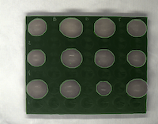

# Living Optics dataset readers


These examples use the [Living Optics SDK](https://cloud.livingoptics.com/shared-resources?file=software/).

- 🌈 + 📈 Explore real hyperspectral datasets in your own workflows.
- 🧐 + 🔧 Learn to build models for classification and regression from spectral data.
- 📀 + 🚀 Access easy-to-use tools and resources to accelerate your development.

## Getting Started

- New to Living Optics? [Sign up here](https://cloud.livingoptics.com/register) for a free Basic cloud tier account.
- Download the [Living Optics SDK](https://cloud.livingoptics.com/shared-resources?file=software). For SDK installation help, please refer to the [installation guide](https://cloud.livingoptics.com/shared-resources?file=docs/ebooks/install-sdk.pdf).
- Download the [hyperspectral dataset](https://cloud.livingoptics.com/shared-resources?file=annotated-datasets) for training and testing models.

    OR

- Generate a custom dataset, install the [data exploration tool](https://docs.livingoptics.com/product/data-exploration-tool) and follow the data annotation guide.

> 📢 **Note:** Access to the dataset and tools requires at least a Basic cloud tier subscription.

## Available Datasets

|      Name      | Purpose                                                                                                                      |                                     Full Description                                      | Download                                                                                                                                    |
|:--------------:|:-----------------------------------------------------------------------------------------------------------------------------|:-----------------------------------------------------------------------------------------:|:--------------------------------------------------------------------------------------------------------------------------------------------|
| Grapes Dataset | Non-contact sugar estimation from hyperspectral data. Containing sugar levels, measured as total Brix and grape annotations. | [View on Hugging Face](https://huggingface.co/datasets/LivingOptics/hyperspectral-grapes) | [](https://cloud.livingoptics.com/shared-resources?file=annotated-datasets/Grapes-Dataset.zip) |


The aim of these examples is to show developers how to work with the exported dataset format produced by the data exploration tool.


## Installation:

First, install the Living Optics SDK. Follow the installation guide here:
👉 [SDK Installation Guide](https://docs.livingoptics.com/sdk/install-guide.html)

Then, activate the virtual environment where the SDK is installed:

```bash
source venv/bin/activate
```

Next, install any additional Python dependencies:

```bash
pip install -r requirements.txt
```


## Using the LO Dataset Reader

`lo_dataset_reader.py` Enables python developers to work with Living
Optics datasets exported from the data exploration tool or downloaded from the cloud platform.


### Key Features

- Quickly load and analyse exported datasets
- Plot and save spectra for easy analysis
- Visualise bounding boxes, segmentations, and associated target spectra
- Access metadata including white/black calibration spectra, frame info, and more

To run the reader, ensure you’re in the `lo_dataset_reader` directory:

```bash
python lo_dataset_reader.py --path /path/to/your/dataset.zip --display-figures
```

**Output**: Visualisations will be saved in the `.path/to/your/dataset/{dataset_name}_visualisations` folder.

### Example Visualization Outputs

- `{dataset_name}_visualisations/annotations/grape_frame_0.png` : Annotation bounding box + segmentation
- `{dataset_name}_visualisations/target_spectrum/target_spectrum_tray-tray2.png` : Spectrum plot for the white/black spectrum

📦 Datasets for download: [here](https://cloud.livingoptics.com/shared-resources?file=annotated-datasets).

---

## Extending the Reader with Custom Code

Below is an example of how to iterate over the dataset to retrieve annotations and spectra:

```python
import os
import matplotlib.pyplot as plt
from lo_dataset_reader import DatasetReader, spectral_coordinate_indices_in_mask, rle_to_mask

os.environ["QT_QPA_PLATFORM"] = "xcb"

dataset_path = "/path/to/dataset.zip"
dataset = DatasetReader(dataset_path, display_fig=True)

for idx, ((info, scene, spectra, images_extern), annotations, library_spectra, labels) in enumerate(dataset):
    for ann_idx, annotation in enumerate(annotations):
        annotation["labels"] = labels

        # Visualise the annotation on the scene
        dataset.save_annotation_visualisation(scene, annotation, images_extern, ann_idx)

        # Plot associated spectrum (if available)
        if annotation.get("target_spectra"):
            spectrum = dataset.get_spectrum(annotation["target_spectra"], idx, ann_idx)

            plt.figure()
            plt.plot(spectrum["wavelengths"], spectrum["values"])
            plt.title(f"Spectrum: {spectrum['name']}")
            plt.xlabel("Wavelength")
            plt.ylabel(spectrum["units"])
            plt.tight_layout()

        # Plot spectra from the annotation's segmentation mask
        mask = rle_to_mask(annotation["segmentation"], scene.shape)
        spectral_indices = spectral_coordinate_indices_in_mask(mask, info.sampling_coordinates)

        plt.figure()
        for s in spectra[spectral_indices, :]:
            plt.plot(s)
        plt.title("Spectra from Annotation Mask")
        plt.show()
```

---

## Creating Your Own Reader

To implement your own reader or integrate the Living Optics dataset format into third-party tools, refer to the dataset format definition:

📄 [Dataset Format and Custom Reader Guide](./docs/lo_format_dataset.md)

## License

This software is licensed under the terms described in ./LICENSE.

## Helpful Resources

- [Developer Portal](https://developer.livingoptics.com/)
- [Product Documentation](https://docs.livingoptics.com/) (requires Basic cloud tier access)


## Contribution Guidelines
We welcome contributions to enhance this project. Please follow these steps to contribute:

**Fork the Repository**: Create a fork of this repository to your GitHub account.

**Create a Branch**: Create a new branch for your changes.
**Make Changes**: Make your changes and commit them with a clear and descriptive message.

**Create a Pull Request**: Submit a pull request with a description of your changes.

## Support

For any questions, contact us at [Living Optics support](https://www.livingoptics.com/support).